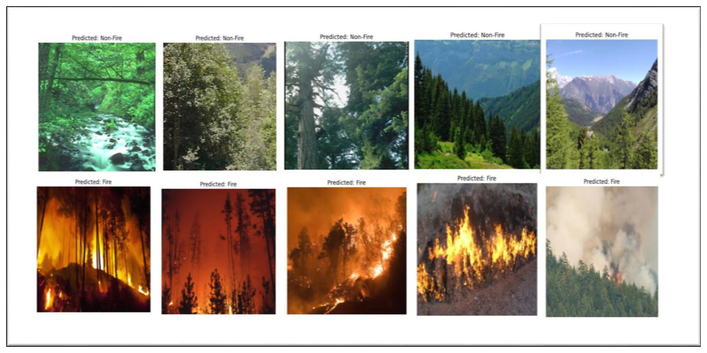
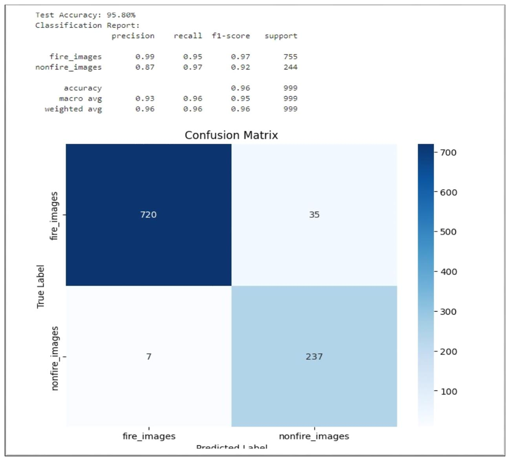

# Forest Fire Detection Using CNN (ResNet-50 Transfer Learning)

> **MCA Final-Semester Project (2024) — Andhra University College of Engineering (A).**
> Awarded the **O grade (Outstanding, 14 credits)**.
> Binary fire / no-fire image classification using a Convolutional Neural Network with **ResNet-50** transfer learning (TensorFlow/Keras).

---

## Overview

This project detects whether an input image contains a forest fire, classifying each image into one of two classes:

- **Fire**
- **No Fire**

The model uses **ResNet-50** with ImageNet pretrained weights, fine-tuned on a labelled fire / no-fire image dataset at 224 × 224 resolution. The goal is to support early fire detection from images captured by cameras, drones, or monitoring systems, where manual observation is slow and hard to scale.

The repository contains the training, evaluation, prediction, and test-case pipelines, a notebook version of the workflow, and the original project report, presentation, and output screenshots.

## Tech Stack

- **Language:** Python
- **Deep learning:** TensorFlow / Keras, ResNet-50 (transfer learning)
- **Data / numerics:** NumPy, Pandas
- **Metrics & viz:** scikit-learn, Matplotlib, Seaborn
- **Image processing:** OpenCV, Pillow
- **Environment:** Jupyter Notebook

## Model Architecture

- ResNet-50 base (`weights="imagenet"`, `include_top=False`), input `224 × 224 × 3`
- Global Average Pooling
- Dense layer (1024 units, ReLU)
- Dropout (default `0.6`)
- Sigmoid output for binary classification
- Optimizer: Adam (default fine-tuning learning rate `1e-5`)
- Loss: binary cross-entropy
- Last 30 ResNet-50 layers unfrozen for fine-tuning (default)
- Training augmentation: rotation, width/height shift, shear, zoom, horizontal flip
- Callbacks: early stopping and best-model checkpointing

## Project Structure

```text
forest-fire-detection-cnn/
├── src/
│   ├── config.py        # image size, batch size, epochs, default model path
│   ├── train.py         # ResNet-50 transfer-learning training pipeline
│   ├── evaluate.py      # test-set evaluation: classification report + confusion matrix
│   ├── predict.py       # single-image prediction
│   └── test_cases.py    # report-style robustness checks
├── notebooks/           # notebook version of the CNN/ResNet-50 workflow
├── reports/             # project report (PDF)
├── presentation/        # final presentation (PDF)
├── docs/                # detailed notes, testing docs, and output screenshots
├── data/                # dataset instructions (images not committed)
├── models/              # model output instructions (trained model not committed)
├── requirements.txt
├── LICENSE
└── README.md
```

## Dataset

The image dataset is **not committed** to this repository. As described in the project report:

- Source: Kaggle (fire / no-fire image dataset)
- Classes: `fire`, `no_fire`
- Training images: 999 · Test images: 999
- Input size: 224 × 224

Download the dataset and place it in the expected structure before training:

```text
data/
├── train/
│   ├── fire/
│   └── no_fire/
└── test/
    ├── fire/
    └── no_fire/
```

Folder names must be exactly `fire` and `no_fire`.

## How to Run

```bash
# 1. Clone and install dependencies
git clone https://github.com/krishna-chandra-dolai/forest-fire-detection-cnn.git
cd forest-fire-detection-cnn
pip install -r requirements.txt

# 2. Train (after placing the dataset under data/)
python -m src.train --train-dir data/train --val-dir data/test --epochs 20 \
    --model-out models/forest_fire_resnet50.keras

# 3. Evaluate on the test set (writes classification report + confusion matrix)
python -m src.evaluate --model models/forest_fire_resnet50.keras \
    --test-dir data/test --output-dir models/evaluation

# 4. Predict on a single image
python -m src.predict --model models/forest_fire_resnet50.keras --image path/to/image.jpg

# 5. Report-style robustness tests (load, fire/no-fire, rotation, blur, lighting, outlier)
python -m src.test_cases --model models/forest_fire_resnet50.keras \
    --fire-image path/to/fire.jpg --no-fire-image path/to/no_fire.jpg \
    --outlier-image path/to/outlier.jpg
```

## Verification scope

The graded report records 12 passed test cases. The current `src/test_cases.py` script automates the model-load and image-level fire/no-fire, rotation, blur, lighting, and outlier checks. Full-dataset generalization, adversarial, large-batch, scalability, and post-deployment cases still require the appropriate model, dataset, or live stream; the script reports that limitation instead of fabricating an automated pass.

## Results

The following results are taken from the graded project report. The dataset and trained model are
not committed, so they are not reproduced by this repository as-is and may vary with dataset split,
preprocessing, and random initialization.

| Metric | Value |
|---|---:|
| Test accuracy | 95.80% |
| Validation accuracy | 96.00% |
| Validation loss | 0.0458 |
| Test loss | 0.1589 |

**Classification report (from the report):**

| Class | Precision | Recall | F1-score |
|---|---:|---:|---:|
| Fire | 0.99 | 0.95 | 0.97 |
| No Fire | 0.87 | 0.97 | 0.92 |
| Weighted avg | 0.96 | 0.96 | 0.96 |

The model favours high fire precision (few false fire alarms) while keeping strong recall — in a
fire-detection setting, missing a real fire is more costly than an occasional false alarm.

Report code and output screenshots are available under `docs/screenshots/`.

### Visual evidence





See the curated [results gallery](docs/results-gallery.md) for the sharp Fire/Non-Fire prediction examples, training log, classification report, and image provenance. These are report-derived artifacts; the repository does not claim that they were freshly reproduced without the original dataset and model checkpoint.

## Future Improvements

- Publish the trained model via GitHub Releases or Git LFS.
- Save executed notebook outputs on the real dataset.
- Add Grad-CAM explanations for model interpretability.
- Compare ResNet-50 against EfficientNet, DenseNet, or Vision Transformers.
- Train on larger and more diverse fire / no-fire datasets.

## License

Released under the [MIT License](LICENSE).

## Author

**Krishna Chandra Dolai** — Master of Computer Applications, Andhra University College of Engineering (A).
