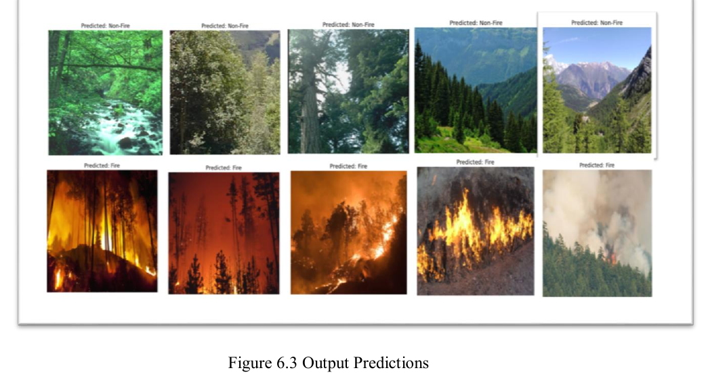
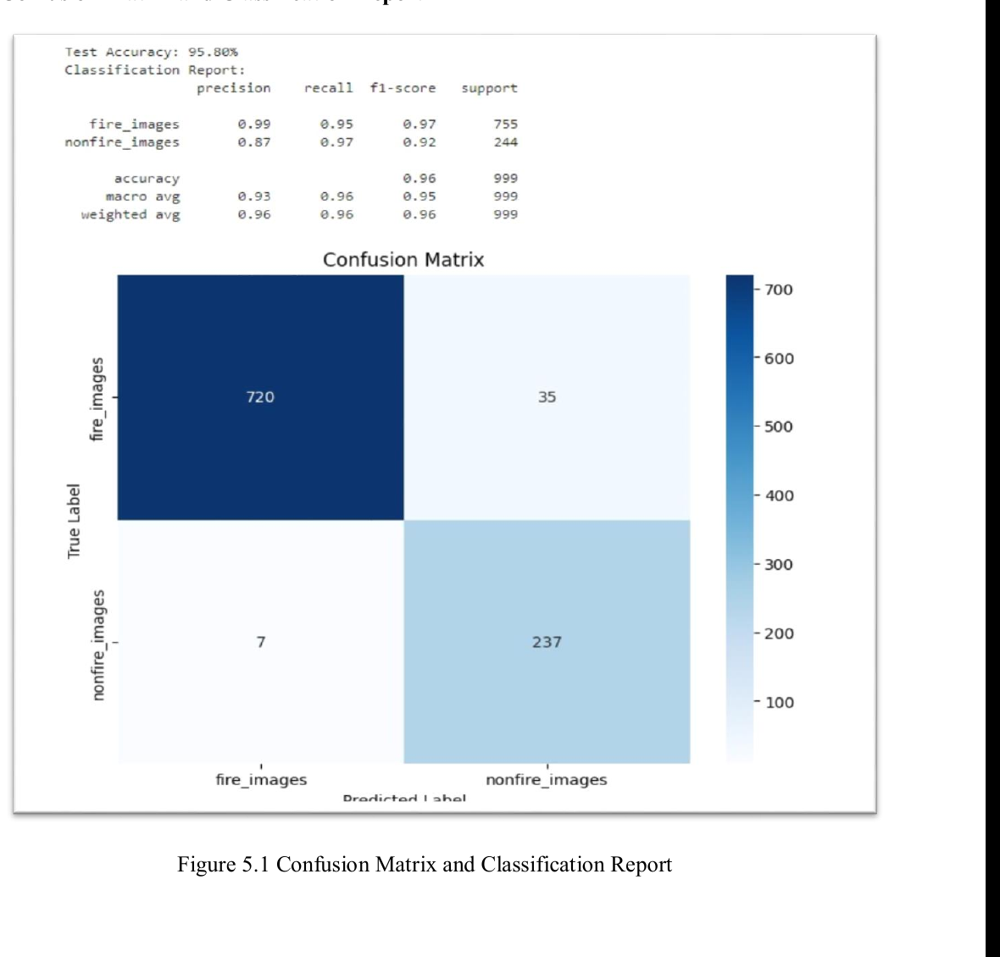
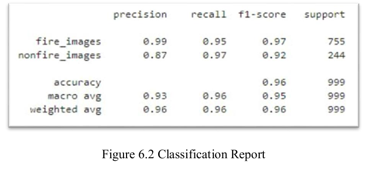
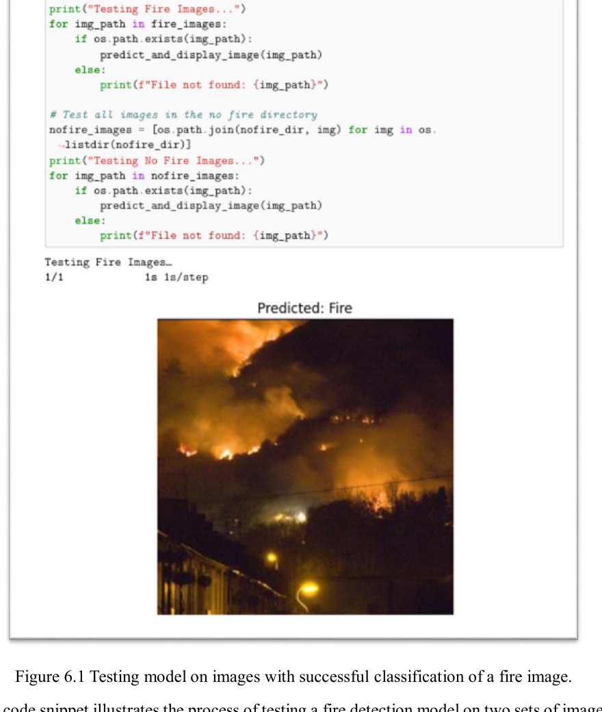

# Forest Fire Detection Using CNN

Binary forest fire image classification using a Convolutional Neural Network with ResNet-50 transfer learning.

## Project Overview

This project detects whether an input image belongs to one of two classes:

- Fire
- No Fire

The model uses ResNet-50 with ImageNet transfer learning, TensorFlow/Keras, and 224 x 224 image input. The goal is to support early fire detection from image data captured by cameras, drones, or monitoring systems.

## Problem Statement

Forest fires can spread quickly and cause major environmental, economic, and human damage. Manual monitoring is slow and difficult at scale. This project applies deep learning to classify images as fire or no fire, helping support faster detection and response.

## Key Features

- Binary image classification: fire vs no fire
- ResNet-50 based transfer learning
- TensorFlow/Keras implementation
- Image preprocessing and augmentation
- Early stopping and best-model checkpointing
- Confusion matrix generation
- Single-image prediction script
- Separate evaluation script for classification report and confusion matrix
- Report-style test-case script for robustness checks
- Jupyter Notebook version of the CNN workflow
- Project report, presentation, and output screenshots included

## Tech Stack

- Python
- TensorFlow/Keras
- ResNet-50
- NumPy
- scikit-learn
- Matplotlib
- Seaborn
- OpenCV/Pillow
- Jupyter Notebook

## Project Structure

```text
forest-fire-detection-cnn/
|-- README.md
|-- requirements.txt
|-- .gitignore
|-- LICENSE
|-- PROJECT_STRUCTURE.md
|-- data/
|   `-- README.md
|-- docs/
|   |-- screenshots/
|   |-- implementation-and-testing.md
|   |-- project-details.md
|   `-- local-file-inventory.md
|-- models/
|   `-- README.md
|-- notebooks/
|   `-- forest_fire_detection_cnn_resnet50.ipynb
|-- presentation/
|   `-- final-presentation.pdf
|-- reports/
|   `-- forest-fire-detection-using-cnn.pdf
|-- src/
|   |-- __init__.py
|   |-- config.py
|   |-- evaluate.py
|   |-- train.py
|   |-- test_cases.py
|   `-- predict.py
`-- legacy/
    `-- old/unrelated CSV-based project files
```

## Dataset Instructions

The dataset is not included in this repository. Download it manually and place it inside `data/`.

Dataset source: [Add Kaggle dataset link here]

The project report mentions:

- Dataset source: Kaggle
- Training images: 999
- Test images: 999
- Classes: `fire` and `no_fire`
- Input image size: 224 x 224

Expected dataset structure:

```text
data/
|-- train/
|   |-- fire/
|   `-- no_fire/
`-- test/
    |-- fire/
    `-- no_fire/
```

Class folder names must be exactly `fire` and `no_fire`.

## Model Architecture

The model is built using:

- ResNet-50 base model
- ImageNet pretrained weights
- `include_top=False`
- Global average pooling
- Dense layer with ReLU activation
- Dropout, using the report's `0.6` dropout setting by default
- Sigmoid output layer for binary classification
- Adam optimizer, using the report's `1e-5` fine-tuning learning rate by default
- Binary cross-entropy loss
- Fine-tuning of the last 30 ResNet-50 layers by default

The trained model is not included in this repository. After training, it is saved locally as:

```text
models/forest_fire_resnet50.keras
```

## Results

| Metric | Value |
|---|---:|
| Test Accuracy | 95.80% |
| Validation Accuracy | 96.00% |
| Validation Loss | 0.0458 |
| Test Loss | 0.1589 |

These results are based on the project report and may vary depending on dataset split, training environment, preprocessing, and random initialization.

## Setup

```bash
git clone https://github.com/krishna-krishna-26/forest-fire-detection-cnn.git
cd forest-fire-detection-cnn
pip install -r requirements.txt
```

## Training

```bash
python -m src.train --train-dir data/train --val-dir data/test --epochs 20 --model-out models/forest_fire_resnet50.keras
```

## Evaluation

```bash
python -m src.evaluate --model models/forest_fire_resnet50.keras --test-dir data/test --output-dir models/evaluation
```

This writes:

```text
models/evaluation/classification_report.txt
models/evaluation/confusion_matrix.png
```

## Prediction

```bash
python -m src.predict --model models/forest_fire_resnet50.keras --image path/to/image.jpg
```

Expected prediction output:

```text
Prediction: Fire
Fire probability: 0.9321
```

## Report-Style Test Cases

```bash
python -m src.test_cases --model models/forest_fire_resnet50.keras --fire-image path/to/fire.jpg --no-fire-image path/to/no_fire.jpg --outlier-image path/to/outlier.jpg
```

This script covers the practical model-load, fire/non-fire prediction, rotation, blur, lighting, and outlier tests described in the project report.

## Screenshots

CNN/ResNet-50 report outputs:









More screenshots are available in `docs/screenshots/`.

## Project Status

The repository is structured for review by recruiters and interviewers. It includes source code, a CNN notebook, project report, presentation, documentation, and output screenshots.

The original CNN dataset and trained model file are not committed. Add them locally before training or prediction.

## Future Improvements

- Add the official Kaggle dataset link.
- Add the trained model through GitHub Releases or Git LFS if required.
- Save executed CNN notebook outputs after running on the real dataset.
- Add Grad-CAM visual explanations.
- Compare ResNet-50 with EfficientNet, DenseNet, or Vision Transformers.
- Improve robustness using larger and more diverse fire/no-fire datasets.

## Author

Krishna Chandra Dolai

Master of Computer Applications, Andhra University College of Engineering (A), Andhra University.
