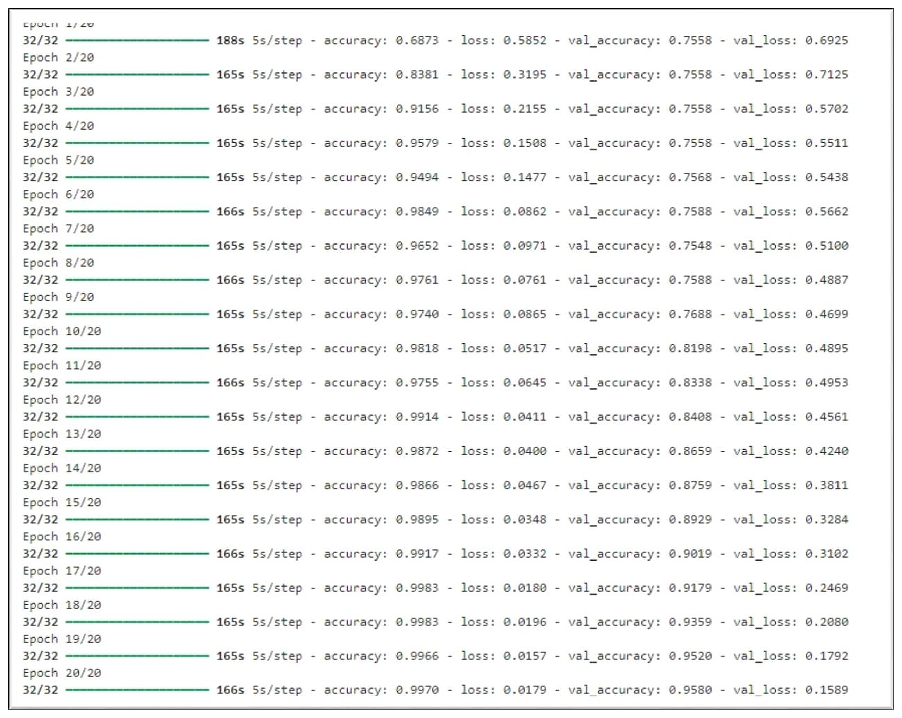
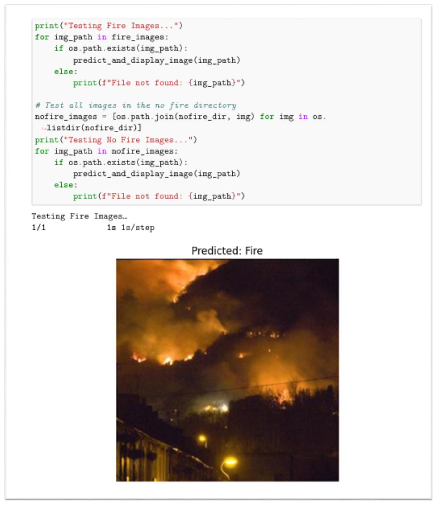

# Results Gallery

These images are evidence extracted from the graded MCA project report. They are not newly reproduced results: the original dataset and trained checkpoint are not committed to this repository.

Source report SHA-256: `272E8EE0B071940D949D06C0B84F103973B957AC02018CCADD9B90812E47EC48`.

The featured images below use the PDF's original embedded figures, prepared at 2x resolution for a sharper GitHub view. Labels, predictions, and metrics were not rewritten.

## Fire and Non-Fire output predictions

The report output shows five samples labelled `Predicted: Non-Fire` followed by five samples labelled `Predicted: Fire`.

## Evaluation summary

The report records 95.80% test accuracy. For the Fire class it records 99% precision, 95% recall, and 97% F1. The displayed evaluation contains 999 images.

| Actual class | Predicted Fire | Predicted Non-Fire |
|---|---:|---:|
| Fire | 720 | 35 |
| Non-Fire | 7 | 237 |

## Training overview

## Single Fire prediction

## Additional evidence

- [Sharp classification report](results/report-derived/classification-report-sharp.png)
- [Sharp-image provenance and preparation notes](results/report-derived/README.md)
- [Original report-page screenshots](screenshots/README.md)
- [Data augmentation code](screenshots/cnn-report/cnn-data-augmentation-code.png)
- [Model training code](screenshots/cnn-report/cnn-model-training-code.png)
- [All report screenshots](screenshots/README.md)
