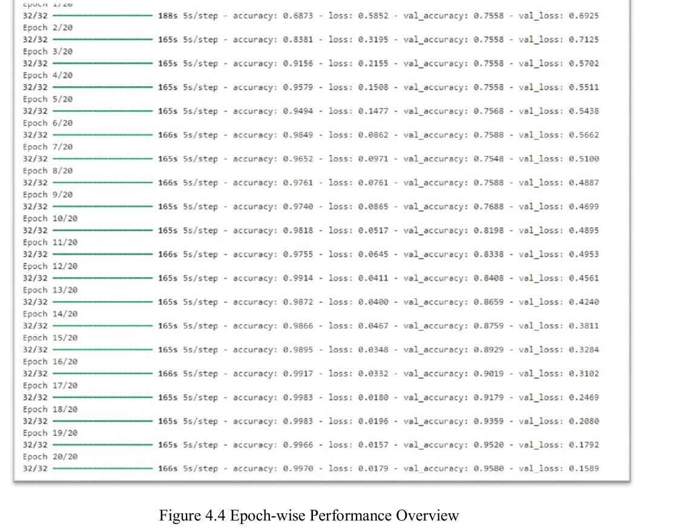

# Results Gallery

These images are evidence extracted from the graded MCA project report. They are not newly reproduced results: the original dataset and trained checkpoint are not committed to this repository.

Source report SHA-256: `272E8EE0B071940D949D06C0B84F103973B957AC02018CCADD9B90812E47EC48`.

## Evaluation summary

The report records 95.80% test accuracy. For the Fire class it records 99% precision, 95% recall, and 97% F1. The displayed evaluation contains 999 images.

## Training overview

## Prediction examples

| Fire prediction | Sample predictions |
|---|---|
|  |  |

## Additional evidence

- [Classification report](screenshots/cnn-report/cnn-classification-report.png)
- [Data augmentation code](screenshots/cnn-report/cnn-data-augmentation-code.png)
- [Model training code](screenshots/cnn-report/cnn-model-training-code.png)
- [All report screenshots](screenshots/README.md)
